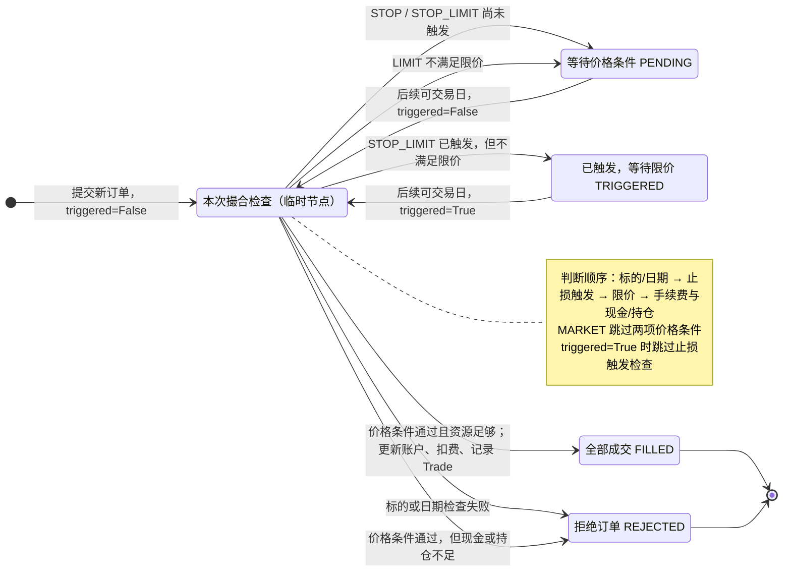

# 模拟交易：费用与挂单

公共包位于项目根目录的 `backtest/`。推荐导入：

```python
from backtest import Account, SimBroker, Engine, Order, Strategy
from backtest.allocation import PeriodicAllocationStrategy
```

从 q1/q2/q3 等子目录运行 notebook 时，先将项目根目录加入 `sys.path`：

```python
from pathlib import Path
import sys

root = next(p for p in (Path.cwd(), *Path.cwd().parents)
            if (p / "backtest").is_dir() and (p / "pyproject.toml").is_file())
if str(root) not in sys.path:
    sys.path.insert(0, str(root))
```

当前公共入口是 `backtest`；项目已移除旧的 `xquant_learning` 目录。

旧调用仍有效：`Order("510300.SS", "BUY", 100)` 默认是市价单，
`SimBroker(source, start, end, symbols)` 和 `Engine(...).run()` 无需改变参数。
默认行为新增双向手续费，因此接口兼容不代表收益数字不变。

## 手续费

每一笔完整成交订单单独收费 `max(成交股数 * 成交价 * 0.001, 5)`；
买入扣成交额与手续费，卖出收入扣手续费。挂单、撤单、拒单不收费。
`Trade.commission` 记录费用，`sum(t.commission for t in broker.trades)` 得到累计费用。
当前不按分舍入，不另计税费/滑点；不做部分成交。

```python
# 显式复现旧的零成本模拟
broker = SimBroker(source, start, end, symbols,
                   commission_rate=0, minimum_commission=0)
```

公共 PeriodicAllocationStrategy 在引擎启动时绑定券商费用模型，先生成卖单，
再按资金可负担的整数股数生成买单。买单按标的顺序安排；费用会使实际权重
偏离目标。自定义策略仍需自行预算手续费，券商不会自动缩小用户委托数量。

## 委托示例

```python
market = Order("510300.SS", "BUY", 100)
limit = Order("510300.SS", "BUY", 100, order_type="LIMIT", limit_price=3.8)
stop = Order("510300.SS", "SELL", 100, order_type="STOP", stop_price=3.5)
stop_limit = Order("510300.SS", "SELL", 100, order_type="STOP_LIMIT",
                   stop_price=3.5, limit_price=3.4)
# 买入止损：观察价 >= stop_price 触发；卖出止损：观察价 <= stop_price 触发。
```

挂单不要求委托价一定高于或低于当前价格：可立即满足条件的订单会立即撮合。
买入限价要求观察价 <= limit_price，卖出要求观察价 >= limit_price，等号也成交。
成交价采用实际观察价，可能优于限价。止损市价跳空时按实际观察价成交，
不保证触发价；止损限价一旦触发即记住状态，后续仅判断限价。
例：卖出止损95、限价92，下一观察价80时触发但不成交，后来反弹到96仍可成交。

## `_match` 订单状态机

下图对应 `broker.py` 中的 `_match(account, order, date, order_id, triggered=False)`。
`Matching` 是图中表示一次函数调用的临时节点，不是 `OrderResult.status`。
函数每次只返回一个结果；挂单的保存与移除由调用方的 `_save()` 完成。



### 图中条件与源码的对应关系

设 `p` 为当日配置的观察价（Open 或 Close）、`q` 为委托股数、
`fee = estimate_commission(q * p)`。

| 判断步骤 | BUY | SELL | 未通过时返回 |
| --- | --- | --- | --- |
| 标的、日期检查 | 标的同时属于券商候选集、账户持仓字典，日期属于共同交易日 | 同左 | `REJECTED` |
| 止损触发：仅 STOP / STOP_LIMIT，且此前未触发 | `p >= stop_price` | `p <= stop_price` | `PENDING` |
| 限价：仅 LIMIT / STOP_LIMIT | `p <= limit_price` | `p >= limit_price` | 普通限价单为 `PENDING`；已触发止损限价单为 `TRIGGERED` |
| 资源检查：仅价格条件通过后执行 | `q * p + fee <= account.cash + 1e-12` | `q <= 持仓股数`，且 `account.cash + q * p >= fee` | `REJECTED` |
| 所有检查通过 | 扣成交额、增加持仓，再扣手续费 | 增加成交额、减少持仓，再扣手续费 | `FILLED`，成交价为 `p` |

注意以下状态边界：

- **触发会被记住。** `execute_orders()` 将上次的 `TRIGGERED` 转成下一次调用的
  `triggered=True`；止损限价单之后只判断限价，不会退回未触发状态。
- **触发不必单独落一条记录。** STOP 触发后直接检查资源；STOP_LIMIT 如果在
  同一次调用中同时满足触发价、限价和资源条件，也直接返回 `FILLED`。
  `TRIGGERED` 专门表示“已触发但限价不允许成交”。
- **拒单检查有先后顺序。** 未满足价格条件时先返回等待状态，即使此时现金或
  持仓不足也不会提前拒绝；真正可以成交时才检查资源。拒单后不再保留挂单。
- **只有 FILLED 改变账户并收手续费。** PENDING、TRIGGERED、REJECTED 不改现金或持仓。
- **撤单不属于 `_match`。** `cancel_order()` 可将 PENDING / TRIGGERED 变成
  `CANCELED`；因此上图没有把它画成 `_match` 的输出。`reset()` 则清空订单，
  不为每笔订单产生 CANCELED 记录。
- **非交易日的入口行为不同。** 新订单若在非交易日进入 `_match` 会被拒绝；
  已有挂单由 `execute_orders()` 跳过该日，不进入 `_match`，仍保留原状态。
  同日已评估的旧挂单也会被跳过。

例如卖出 STOP_LIMIT 的触发价为95、限价为92，观察价依次为100、80、96，
且持仓与资金足够，其状态依次为 `PENDING → TRIGGERED → FILLED`。
在96成交时不需要再次满足“价格不高于95”，因为触发状态已经锁存。

## 日线撮合时序

当前模型只在 `execution_price="open"` 或 `"close"` 指定的单个日线价格点观察。
没有模拟盘中最高/最低触价与先后顺序。例如开盘100、收盘80，在open模式下，
卖出止损90不会仅因收盘80就在当日成交。停牌或缺失日仍沿用公共券商的共同日期规则。

引擎每个交易日先处理旧挂单，再让策略读取更新后的账户、生成新订单。
所有旧单按提交顺序匹配，新单按策略返回顺序匹配。同一天重复推进不会重复撮合旧单。
收盘模式中的same_close依然是理想化研究假设。

```python
results = broker.execute_orders(account, [limit], date)
order_id = results[0].order_id
print(broker.pending_orders)   # 只读最新状态快照
# 下一日即使没有新单也能推进，Engine已自动调用：
broker.execute_orders(account, [], next_date)
# 只可取消仍在挂单列表中的订单：
broker.cancel_order(order_id)
```

状态为PENDING、TRIGGERED、FILLED、REJECTED、CANCELED。
`order_history` 是事件记录（每次评估都可能增加一行），不是一单一行；
使用order_id关联。`trades`只包含成交，`pending_orders`只包含未结束订单。
未成交订单持续有效，无默认到期日，回测结束仍可检查。reset清空全部订单并重置编号。
挂单不预冻结资金/股数，成交时再检查；竞争同一资金的后续订单可能被拒，
拒单不会继续挂起。一个券商实例在reset前只绑定一个账户，时间不允许倒退。

账户仍禁止裸卖/做空。买入止损是受支持的委托方向，不意味着已实现空头持仓。
引擎继续每日记录扣费后净资产，既有收益/波动率/回撤/夏普自动包含费用影响。

## 成交后保护单与 q4 实验

`Strategy.after_execution(account, market, date, results)` 是可选钩子，默认返回
空列表，已有策略不必修改。引擎完成当日旧挂单与常规订单处理后调用一次该钩子，
将其返回的保护单按同一价格样本撮合，再记录收盘账户。不会递归调用钩子。
这保证保护单数量依据实际成交后的持仓，而非预计买入股数。

```python
from backtest.risk_controls import ProtectedRiskParityStrategy

strategy = ProtectedRiskParityStrategy(
    symbols, period=20, interval=21, stop_loss=0.10, take_profit=0.20)
```

该策略复用 `PeriodicAllocationStrategy` 的风险平价、费用预算与整数股调仓。
保护价格按单只资产当前持仓的加权平均买入价（不含手续费）：增持更新均价，
部分减持不变，清仓重置。STOP 全仓卖单用于固定止损，LIMIT 全仓卖单用于固定止盈。
调仓或持仓变化后撤旧保护单、按实际股数重挂。一边成交后，策略撤另一边，
但这只是每日单价格样本下的互斥管理，不是券商原生、盘中原子的 OCO。

保护退出后资金留现金，不按其余资产权重再分配；下一次计划调仓才可再入场，
退出当天即使遇到调仓也不能重买同一标的。新保护单可在创建时立即满足条件。
这些规则以及三步样本内夏普选优在 `q4/when-to-trade.ipynb` 中完整说明。

## 通用保护策略与绩效分析（q5）

q4 的 `ProtectedRiskParityStrategy` 构造方式保持不变；保护逻辑现在由
`ProtectedAllocationStrategy` 复用，可对等权、风险平价或 RAM 配置挂单：

```python
from backtest.risk_controls import ProtectedAllocationStrategy
strategy = ProtectedAllocationStrategy("ram", symbols, period=20,
                                       interval=10, stop_loss=0.05)
```

绩效函数位于 `backtest.performance`，输入扣费后的每日账户总资产，不再扣一次费用：

```python
from backtest.performance import performance_metrics, calendar_year_metrics
total = performance_metrics(ledger.portfolio_value, initial_cash, mar_annual=0.0)
annual = calendar_year_metrics(ledger.portfolio_value, initial_cash, mar_annual=0.0)
```

输出八项指标：期末净值、累计收益、日历时长 CAGR、252日年化波动、正值最大回撤、
零无风险利率简化夏普、CAGR/最大回撤的卡玛、基于 MAR 下行偏差的年化索提诺。
下行偏差使用全部日收益为分母：`sqrt(mean(min(r-MAR_daily, 0)**2))`，
不是只取负收益再计算标准差；年化 MAR 先折算成日 MAR。零分母返回 NaN。

年度切片不重启回测：期初资产取上一年最后的收盘总资产，首日收益与其比较；
年度局部回撤从该期初资产重新计算峰值。完整中间年份按12月31日边界估值，
非交易日沿用最近收盘价；首末区间按实际观测边界，并标记非完整年度。
各年的收益因子相乘等于总区间的收益因子。完整年度也统一使用365.25日年长。
`q5/how-to-validate.ipynb` 保存总指标、年度指标、费用与交易明细及四组可视化。

q5 还包含 `backtest.allocation.BuyAndHoldEqualWeightStrategy(symbols)` 基准：
首个共同交易日按收盘价初始等权买入，沿用整数股与手续费预算，此后不调仓、
不卖出、不挂保护单，剩余现金不再投入。后续资产权重随价格漂移。
回测末日按收盘价估值，不强制平仓，因而只发生初始买入手续费。

### 月度分布与回撤事件

```python
from backtest.performance import (
    calendar_month_returns, monthly_return_statistics, drawdown_events,
)
monthly = calendar_month_returns(ledger.portfolio_value, initial_cash)
monthly_stats = monthly_return_statistics(monthly)
events = drawdown_events(ledger.portfolio_value, initial_cash, threshold=-0.001)
top5 = events.sort_values("depth").head(5)
```

自然月收益使用当月最后净资产除以上月最后净资产，首月分母为初始本金。
首末不完整月保留、不外推；缺失整月会报错，不擅自填充。月收益因子连乘
等于全程净值。零收益月计入总月数，但不算盈利或亏损并打断连续盈亏。
盈亏比使用条件均值；Profit Factor 使用正月收益率之和除以负月收益率之和
绝对值，是月收益分布指标，不是金额或交易级指标。无分母返回 NaN。

`threshold=-0.001` 表示筛选深度达到 **-0.1%** 的回撤事件，恢复仍要求回到
原来的峰值，不能只回到阈值上方。开始日期取最近前峰，触发日期另行保留；
首次到达最深位置为最低点。深度为负值，升序排序得到最深事件。
下跌和恢复天数分别为峰值至最低点、最低点至恢复日期的自然日间隔。
未恢复事件的恢复日期为 NaT、恢复天数为 NaN，末次观测日期不能视作恢复。
初始本金也参与峰值，若首日因费用已经回撤，则前峰标记在首个观测日期。
q5 追加六个策略的月度统计、分布直方图/箱线图、前5事件表和水下曲线，
所有计算复用同一份扣费后每日净资产，不重复扣费、不重新运行分月策略。

### 独立指标窗口与 q5 敏感性扫描

`allocation_weights`、`PeriodicAllocationStrategy`、`ProtectedAllocationStrategy`
及兼容包装类 `ProtectedRiskParityStrategy` 支持两个可选关键字参数：
`momentum_window` 和 `volatility_window`。不传时仍各自使用旧 `period`，
因此已有 q3/q4/q5 调用无需修改，两个窗口均为20时逐日结果不变。

```python
strategy = ProtectedAllocationStrategy(
    "ram", symbols, period=20, interval=10, stop_loss=0.05,
    momentum_window=15, volatility_window=30,
)
```

RAM 的分子用动量窗口内日均对数收益，分母用波动率窗口内日收益样本标准差，
需要两个窗口中较大者加1个收盘价。风险平价只用波动率窗口，动量窗口既不
影响权重，也不影响预热。预热期间持有现金，达到要求后的计划调仓日才入场。
窗口必须为大于等于2的整数。下单、费用、保护单规则均未改变。

q5 现在同步扫描RAM的两个窗口：`momentum_window = volatility_window = 扫描值`。
风险平价只扫描波动率窗口。默认10/15/20/25/30/40六个值、四个策略，输出24条
记录（4条基线复用，新增20次回测）。这是同值组合扫描，不是6×6完整联合网格，
也不再分离两个窗口的独立影响；公共模块仍支持不同窗口供后续实验使用。
有效参数相同的实验复用结果，不同参数创建独立账户/券商/策略。每个20日基线
点都与原完整账户序列核对。另存首次买入日、费用和成交数，因为不同窗口的
预热可推迟建仓；指标差异并不只来自后续权重。图中最大回撤为正数、越小越好。
全区间扫描仅是样本内敏感性诊断，不能代替样本外/滚动验证或证明联合最优。
